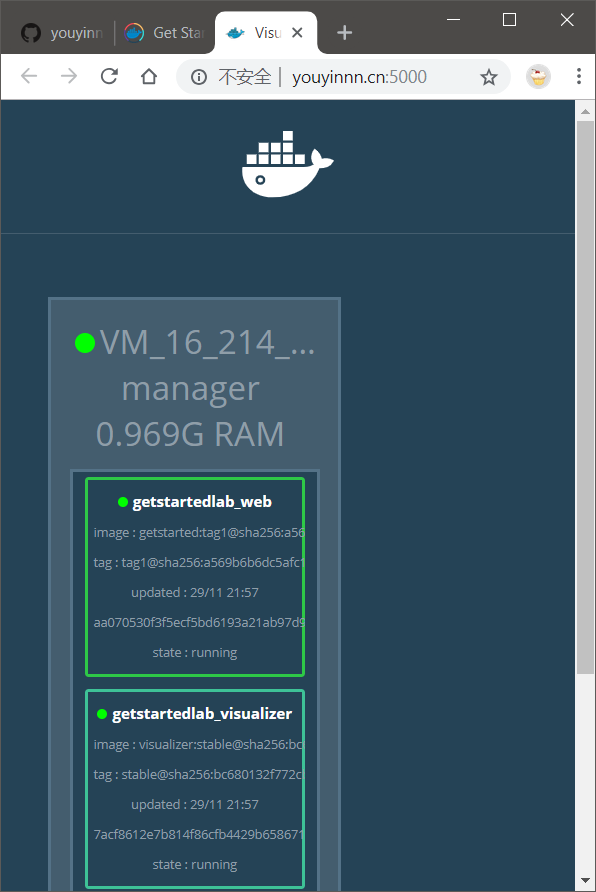

### Introduction

At the part of "Container", we've know we can define a `docker-compose.yaml` to deploy a service on our swarm so it can run on multiple machine.

As we practice before, our service just contains one container: a python app that provide web service with Flask.

But did you remember that sentence ? **Services are really just "Containers in Production"**

So we can define multiple containers in one service !!! Sounds nice isn't it ?

This is what they call **"a Stack"**, and that sounds very confused.

### Stack

A stack is a group of interrelated services that share dependencies, and can be orchestrated and scaled together.

A single stack is capable of defining and coordinating the functionality of an entire application (though very complex applications may want to use multiple stacks).

We've been technically work with stack while we deploy a Composefile with `docker stack deploy`. But that was a single service stack running on a single host, which is not usually what takes place in production. Here, you can take what you’ve learned, make multiple services relate to each other, and run them on multiple machines.

> Now we should build up a main concept for this:
>
> 1. one service mapping one containers
> 2. one stack including multiple servcices
> 3. one stack can running at multiple machines

1. composefile

   ```yaml
   version: "3"
   services:
     web:
       # replace username/repo:tag with your name and image details
       image: youyinnn/getstarted:tag1
       deploy:
         replicas: 3
         restart_policy:
           condition: on-failure
         resources:
           limits:
             cpus: "0.1"
             memory: 50M
       ports:
         - "4000:80"
       networks:
         - webnet
     visualizer:
       image: dockersamples/visualizer:stable
       ports:
         - "5000:8080"
       volumes:
         - "/var/run/docker.sock:/var/run/docker.sock"
       deploy:
         placement:
           constraints: [node.role == manager]
       networks:
         - webnet
   networks:
     webnet:
   ```

   The only thing new here is the peer service to `web`, named `visualizer`. Notice two new things here: a `volumes` key, giving the visualizer access to the host’s socket file for Docker, and a `placement` key, ensuring that this service only ever runs on a swarm manager -- never a worker. That’s because this container, built from [an open source project created by Docker](https://github.com/ManoMarks/docker-swarm-visualizer), displays Docker services running on a swarm in a diagram.

   We talk more about placement constraints and volumes in a moment.

2. Re-run the `docker stack deploy` command on the manager, and whatever services need updating are updated

   As we just got a cloud server, so we can just simply deploy our stack on one machine and continue the learning.

   ```bash
   # make sure you've run `docker swarm init`
   $ docker stack deploy -c docker-compose.yml getstartedlab
   Updating service getstartedlab_web (id: angi1bf5e4to03qu9f93trnxm)
   Creating service getstartedlab_visualizer (id: l9mnwkeq2jiononb5ihz9u7a4)
   ```

3. Check stack's status

   ```bash
   $ docker stack ps getstartedlab
   ID                  NAME                         IMAGE                             NODE                DESIRED STATE       CURRENT STATE            ERROR               PORTS
   xixa1lh6topy        getstartedlab_web.1          youyinnn/getstarted:tag1          VM_16_214_centos    Running             Running 28 minutes ago
   upz5s23iduz6        getstartedlab_visualizer.1   dockersamples/visualizer:stable   VM_16_214_centos    Running             Running 28 minutes ago
   kr8sdm9g4qnl        getstartedlab_web.2          youyinnn/getstarted:tag1          VM_16_214_centos    Running             Running 28 minutes ago
   ```

4. Take a look at the `visualizer`

   

   and you can also visit the port:4000 to visit the Flask web app.

### A preview of persist data from docker container to host

There still a section about **"Persist data"** on offical doc, it show us how to create a redis service and presist data from container's inside filesystem to host filesystem. We will just take a look for the compose file and explain it's usage.

```yaml
version: "3"
services:
  web:
    # ...
  visualizer:
    # ...
  redis:
    image: redis
    ports:
      - "6379:6379"
    volumes:
      - "/home/docker/data:/data"
    deploy:
      placement:
        constraints: [node.role == manager]
    command: redis-server --appendonly yes
    networks:
      - webnet
networks:
  webnet:
```

Redis has an official image in the Docker library and has been granted the short `image` name of just `redis`, so no `username/repo` notation here.

**The Redis port, 6379, has been pre-configured by Redis** to be exposed from the container to the host, and here in our Compose file we expose it from the host to the world, so you can actually enter the IP for any of your nodes into Redis Desktop Manager and manage this Redis instance, if you so choose.

**Most importantly**, there are a couple of things in the `redis` specification that make data persist between deployments of this stack:

- `redis` always runs on the manager, so it’s always using the same filesystem.
- `redis` accesses an arbitrary directory in the host’s file system as `/data` inside the container, which is where Redis stores data.

Together, this is creating a **“source of truth”** in your host’s physical filesystem for the Redis data. Without this, Redis would store its data in `/data` inside the container’s filesystem, which would get wiped out if that container were ever redeployed.

This source of truth has two components:

- The **placement** constraint you put on the Redis service, ensuring that it always uses the same host.

- The **volume** you created that lets the container access `./data` (on the host) as `/data` (inside the Redis container). While containers come and go, the files stored on `./data` on the specified host persists, enabling continuity.

  > In other words, anything you write to redis will stored on `/home/docker/data` on your host.

You are ready to deploy your new Redis-using stack.
