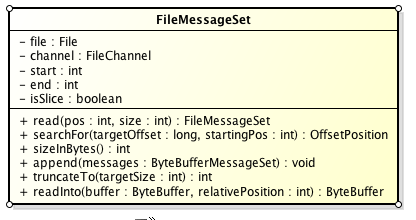
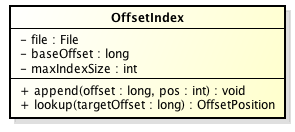
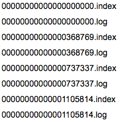
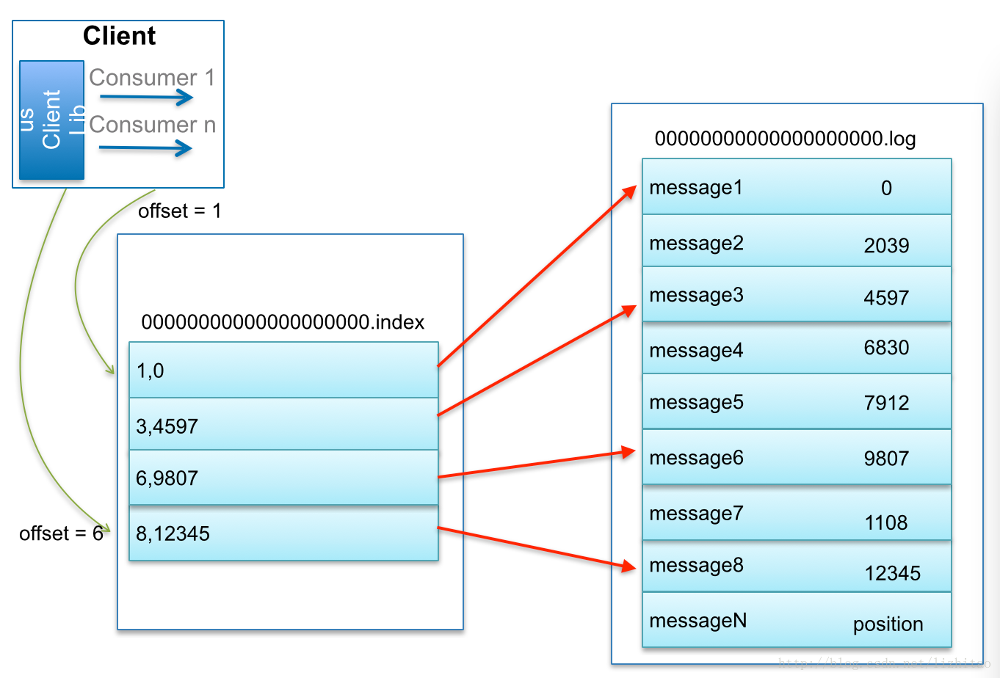

### Topic & Partition

kafka 中的 Message 以 topic 为分类去组织的，每个 topic 又可以分为不同的 partition 去存储：

我们引用官方的 Introduction 中的一节，看官方是怎么解释的：

Each partition is an ordered, immutable sequence of records that is continually appended to—a structured commit log. The records in the partitions are each assigned a sequential id number called the _offset_ that uniquely identifies each record within the partition.

每个分区都是一个**有序的，不可变的记录序列**，不断附加到结构化的提交日志中。分区中的记录每个都分配了一个称为偏移的顺序 ID 号，它唯一地标识分区中的每个记录。

The Kafka cluster durably persists all published records—whether or not they have been consumed—using a configurable retention period. For example, if the retention policy is set to two days, then for the two days after a record is published, it is available for consumption, after which it will be discarded to free up space. Kafka's performance is effectively constant with respect to data size so storing data for a long time is not a problem.

Kafka 集群使用**可配置的保留期（configurable retention period）**，来持久保存所有已发布的记录，无论是否已**消费（consume）**。

例如，如果保留策略设置为两天，则在发布记录后的两天内，它都是可供消费（consume）的，之后将被**丢弃（discarded）**以释放空间。Kafka 的性能在数据大小方面实际上是恒定的，因此长时间存储数据不是问题。

In fact, the only metadata retained on a per-consumer basis is the offset or position of that consumer in the log. This offset is controlled by the consumer: normally a consumer will advance its offset linearly as it reads records, but, in fact, since the position is controlled by the consumer it can consume records in any order it likes. For example a consumer can reset to an older offset to reprocess data from the past or skip ahead to the most recent record and start consuming from "now".

实际上，基于每个消费者保留的唯一元数据是该消费者在日志中的**偏移或位置（offset/position）**。

这种偏移由消费者控制：通常消费者在读取记录时会线性地提高其偏移量，但事实上，由于该位置由消费者控制，因此它可以按照自己喜欢的任何顺序消费记录。

例如，消费者可以重置为较旧的偏移量来重新处理过去的数据，或者跳到最近的记录并从“现在”开始消费。

This combination of features means that Kafka consumers are very cheap—they can come and go without much impact on the cluster or on other consumers. For example, you can use our command line tools to "tail" the contents of any topic without changing what is consumed by any existing consumers.

这些功能组合意味着 Kafka 消费者是**“成本较低的”**：他们可以来来往往对集群或其他消费者没有太大影响。

例如，您可以使用我们的命令行工具“tail”任何主题的内容，而无需更改任何现有使用者所消耗的内容。

The partitions in the log serve several purposes. First, they allow the log to scale beyond a size that will fit on a single server. Each individual partition must fit on the servers that host it, but a topic may have many partitions so it can handle an arbitrary amount of data. Second they act as the unit of parallelism—more on that in a bit.

日志中的分区有多种用途：

首先，它们允许日志扩展到超出适合单个服务器的大小。每个单独的分区必须适合托管它的服务器，但主题可能有许多分区，因此它可以处理任意数量的数据。

其次，它们充当了并行性的单位，更多是因为这个原因！

### Partition

上面从大方向上介绍了 Message 的存储是如何 work 的，我们再来关注一下存储的细节

Partition 中的每条 Message 由 offset 来表示它在这个 partition 中的偏移量，这个 offset 不是该 Message 在 partition 数据文件中的实际存储位置，而是逻辑上一个值，它唯一确定了 partition 中的一条 Message。因此，可以认为 offset 是 partition 中 Message 的 id。partition 中的每条 Message 包含了以下三个属性：

- offset

- MessageSize

- data

其中 offset 为 long 型，MessageSize 为 int32，表示 data 有多大，data 为 message 的具体内容。它的格式和 Kafka 通讯协议中介绍的 MessageSet 格式是一致。

Partition 的数据文件则包含了若干条上述格式的 Message，按 offset 由小到大排列在一起。它的实现类为 FileMessageSet，类图如下：

它的主要方法如下：

- append: 把给定的 ByteBufferMessageSet 中的 Message 写入到这个数据文件中。
- searchFor: 从指定的 startingPosition 开始搜索找到第一个 Message 其 offset 是大于或者等于指定的 offset，并返回其在文件中的位置 Position。它的实现方式是从 startingPosition 开始读取 12 个字节，分别是当前 MessageSet 的 offset 和 size。如果当前 offset 小于指定的 offset，那么将 position 向后移动 LogOverHead+MessageSize（其中 LogOverHead 为 offset+messagesize，为 12 个字节）。
- read：准确名字应该是 slice，它截取其中一部分返回一个新的 FileMessageSet。它不保证截取的位置数据的完整性。
- sizeInBytes: 表示这个 FileMessageSet 占有了多少字节的空间。
- truncateTo: 把这个文件截断，这个方法不保证截断位置的 Message 的完整性。
- readInto: 从指定的相对位置开始把文件的内容读取到对应的 ByteBuffer 中。

我们来思考一下，如果一个 partition 只有一个数据文件会怎么样？

> - 新数据是添加在文件末尾（调用 FileMessageSet 的 append 方法），不论文件数据文件有多大，这个操作永远都是 O(1)的。
>
> - 查找某个 offset 的 Message（调用 FileMessageSet 的 searchFor 方法）是顺序查找的。因此，如果数据文件很大的话，查找的效率就低。

那 Kafka 是如何解决查找效率的的问题呢？有两大法宝：1) 分段 2) 索引。

#### 数据文件的分段

Kafka 解决查询效率的手段之一是将数据文件分段，比如有 100 条 Message，它们的 offset 是从 0 到 99。

假设将数据文件分成 5 段，第一段为 0-19，第二段为 20-39，以此类推，每段放在一个单独的数据文件里面，数据文件以该段中最小的 offset 命名。这样在查找指定 offset 的 Message 的时候，用二分查找就可以定位到该 Message 在哪个段中。

#### 为数据文件建索引

数据文件分段使得可以在一个较小的数据文件中查找对应 offset 的 Message 了，但是这依然需要顺序扫描才能找到对应 offset 的 Message。

为了进一步提高查找的效率，Kafka 为每个分段后的数据文件建立了索引文件，文件名与数据文件的名字是一样的，只是文件扩展名为.index。

索引文件中包含若干个索引条目，每个条目表示数据文件中一条 Message 的索引。索引包含两个部分（均为 4 个字节的数字），分别为相对 offset 和 position。

相对 offset：因为数据文件分段以后，每个数据文件的起始 offset 不为 0，相对 offset 表示这条 Message 相对于其所属数据文件中最小的 offset 的大小。

举例，分段后的一个数据文件的 offset 是从 20 开始，那么 offset 为 25 的 Message 在 index 文件中的相对 offset 就是 25-20 = 5。存储相对 offset 可以减小索引文件占用的空间。

position，表示该条 Message 在数据文件中的绝对位置。只要打开文件并移动文件指针到这个 position 就可以读取对应的 Message 了。

index 文件中并没有为数据文件中的每条 Message 建立索引，而是采用了稀疏存储的方式，每隔一定字节的数据建立一条索引。这样避免了索引文件占用过多的空间，从而可以将索引文件保留在内存中。但缺点是没有建立索引的 Message 也不能一次定位到其在数据文件的位置，从而需要做一次顺序扫描，但是这次顺序扫描的范围就很小了。

在 Kafka 中，索引文件的实现类为 OffsetIndex，它的类图如下：

主要的方法有：

- append 方法，添加一对 offset 和 position 到 index 文件中，这里的 offset 将会被转成相对的 offset。
- lookup, 用二分查找的方式去查找小于或等于给定 offset 的最大的那个 offset

### 小结

我们以几张图来总结一下 Message 是如何在 Kafka 中存储的，以及如何查找指定 offset 的 Message 的。

Message 是按照 topic 来组织，每个 topic 可以分成多个的 partition，比如：有 5 个 partition 的名为为 page_visits 的 topic 的目录结构为：

partition 是分段的，每个段叫 LogSegment，包括了一个数据文件和一个索引文件，下图是某个 partition 目录下的文件：

可以看到，这个 partition 有 4 个 LogSegment。

借用博主[@lizhitao](http://blog.csdn.net/lizhitao/)博客上的一张图来展示是如何查找 Message 的。

比如要查找绝对 offset 为 7 的 Message：

首先是用二分查找确定它是在哪个 LogSegment 中，自然是在第一个 Segment 中。
打开这个 Segment 的 index 文件，也是用二分查找找到 offset 小于或者等于指定 offset 的索引条目中最大的那个 offset。自然 offset 为 6 的那个索引是我们要找的，通过索引文件我们知道 offset 为 6 的 Message 在数据文件中的位置为 9807。
打开数据文件，从位置为 9807 的那个地方开始顺序扫描直到找到 offset 为 7 的那条 Message。

**这套机制是建立在 offset 是有序的**。索引文件被映射到内存中，所以查找的速度还是很快的。

一句话，**Kafka 的 Message 存储采用了分区(partition)，分段(LogSegment)和稀疏索引这几个手段来达到了高效性。**

> 参考自：
>
> http://kafka.apache.org/intro
>
> https://blog.csdn.net/jewes/article/details/42970799
