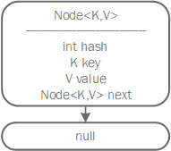
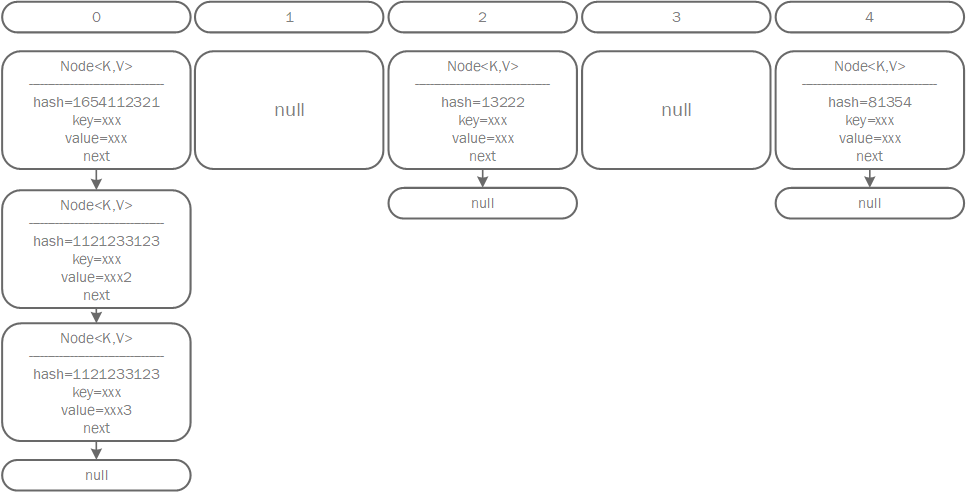
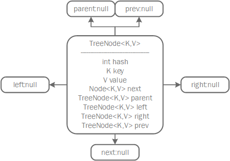

### 前言

一言难尽 直接开始吧 时间有限 就不一一解读接口了

这篇是逐行级别的`HashMap`的**“基础操作”**源码解读，仅仅分析一些核心的**单元素基础操作（CRUD）**，尽可能从大框架思路去分析实现思路，一些太细的变量和无关操作，就不分析太多了

本篇因为时间和精力有限，也跳过了一些很底层的分析如 hash 计算，比特位计算等，网上还有好多大神对于这个分析的比我好得多

**多元素操作如`putAll`**以及一些克隆和序列化的操作的话，就不分析了

开篇即是对于作者实现笔记的解读，你可能觉得就是一篇源码英文翻译，但是到后面到了方法的时候，每行都是根据自己的理解去解读的，如果您有其他的看法，可以留言讨论。

---

### Document 介绍

> 基于哈希表实现的`Map`接口。这个实现提供了所有可选的映射操作，并允许空值和空键。(HashMap 类大致相当于 Hashtable，但它是非同步的，并且允许为空。)这个类不保证映射的顺序；特别地，它不能保证顺序会随时间保持不变（也就是说顺序可能会在其他的操作中被改变）。
>
> 这个实现为基本操作（`get`和`put`）提供了恒定时间的性能，假设哈希函数将元素适当地分散在各个桶（ **buckets，存储元素的结构，后文用仓位描述这个概念** ）中。对集合视图的遍历迭代所花费的时间，与`HashMap`实例的 **“容量（capacity）”** 及其 **大小（键-值映射数）** 成比例。因此，如果迭代性能很重要，那么不要将初始容量设置得太高（或者负载系数太低），这是非常重要的。
>
> `HashMap`实例有两个影响其性能的参数：初始容量 **（initial capacity）** 和负载因子**（load factor）**。容量是哈希表中的桶数**（箱子数）**，初始容量只是创建哈希表时的容量。负载因子是在哈希表的容量自动增加之前，哈希表被允许达到的最大容量的度量**（阈值）**。当哈希表中的条目数量超过负载因子和当前容量的乘积时，哈希表就会被重新哈希(也就是说，重新构建内部数据结构)，这样哈希表的容量大约是原来的两倍。
>
> 一般来说，默认的负载因子**(0.75)**在时间和空间成本之间提供了很好的权衡。较高的值减少了空间开销，但增加了查找成本（反映在`HashMap`类的大多数操作中，包括`get`和`put`）。在设置映射的初始容量时，应该考虑映射中的**期望最大键值对数量**及其**负载因子**，以最小化重哈希**（rehash）**操作的次数。如果初始容量大于**期望最大键值对数量**除以**负载因子**，就不会发生重哈希操作。
>
> 如果要将许多映射（键值对）存储在`HashMap`实例中，那么使用足够大的容量创建映射将使映射存储的效率更高，而不是让它根据需要执行自动重哈希以增长表。注意，使用具有相同`hashCode()`的多个键确实会降低任何散列表的性能。为了改善影响，当键具有可比性时，这个类可以使用键之间的比较顺序来帮助断开连接（避免 hash 冲突）。

### 作者给的实现提示

#### 1.关于整体结构

> 这个 map 实现，在一般的情况下就像是一个个由哈希表（**hash table**）组织起来的箱子一样，但是当这些箱子的数量变得非常大（非常大如何衡量？）的时候，它会用树结点（**TreeNode**）结构去替换箱子的结构，每个结构和`java.util.TreeMap`很相似。
>
> 类中大部分的方法都是在一般的情况下考虑的（**table method**），你可以把它想象成当作一堆普通箱子一样使用，但是在合适的情况下（可能只是简单的判断结构是否`instanceof`一个 Node）会将转接到**TreeNode**结构下可用的方法（**tree method**），这时候你需要讲每个箱子当成一棵树去对待。
>
> **TreeNode**结构下的这些箱子可能会被遍历或者有别的用途，但是在这个**TreeNode**结构里的箱子数量越来越多的情况下，依旧支持以理想的速度进行快速查找操作。然而，考虑到 map 中绝大多数的箱子结构都是一般的结构，那么检查这些树结构箱子的操作就可能在表方法（**table method**）进行的过程中被延迟执行。

#### 2.关于 Tree Bins

> 树箱子（**Tree bins**，箱子都是**TreeNode**结构）的顺序首先由元素的 hashCode（哈希码）决定，但是在有关联的情况下，如果两个元素实现了同一个`class C implements Comparable<C>`接口的话，那么它们的顺序由实现了的比较方法决定（我们保守地通过反射去验证 this 对象来检查泛型--详情见`comparableClassFor`方法）。
>
> 树箱子的增加比较复杂但是绝对值得，最坏的情况下也有**O(logn)**效率，但是操作要求键（KEYS）必须有唯一的哈希（hashs）或者有序性保证，因此，在一些意外情况或者`hashCode()`方法实现得太烂，也就是一些键（KEYS）共享一个 hashCode 的情况下，只要它们还能互相比较，性能会慢慢退化。（如果这些办法都没有被采用，我们可能会在两倍的时间效率或者空间效率上进行比较元素，这是在没有预防措施的情况下。但是这样的情况只会在菜鸟程序员的身上才有可能发生，因为程序已经够慢了，再慢一点也没差）

#### 3.TreeNode 结构带来的性能

> 因为 **TreeNodes** 结构一般都是普通结点大小的两倍左右大，我们仅仅是在当箱子装了足够的结点的时候，为了保证能够继续使用才使用这个结构（看`TREEIFY_THRESHOLD`，树化阈值）。而且当他们的数量变小的时候（移除操作或者恢复大小的操作）它们会变回一般的箱子结构。
>
> 在使用分布良好的用户实现的哈希码的时候，很少使用树箱子结构。
>
> 理想情况中，如果哈希码的实现能保证随机性，那么容器中的节点分布频率遵循[泊松分布](http://en.wikipedia.org/wiki/Poisson_distribution)，默认调整大小的参数平均约为 **0.5** ，阈值为 **0.75** ，虽然由于方差较大，会适当调整分布粒度。（这个意思大致是说，保持容器的载量是容器的容量的 **0.5~0.75** 之间，接近 **0.75** 就需要考虑容器扩容）
>
> 如果忽视方差,预期的列表大小 k 的出现次数是：**(exp(-0.5) \* pow(0.5, k) / 阶乘(k))**，值如下：
>
> - 0: 0.60653066
>
> - 1: 0.30326533
>
> - 2: 0.07581633
>
> - 3: 0.01263606
>
> - 4: 0.00157952
>
> - 5: 0.00015795
>
> - 6: 0.00001316
>
> - 7: 0.00000094
>
> - 8: 0.00000006
>
> 更多的值就已经不到千万分之一了，也就是说在`hashCode()`实现得理想的情况下，几乎容器中几乎不可能出现两位数以上的树箱子。
>
> 树箱的根通常是它的第一个节点。然而，有时（当前的实现，仅在`Iterator.remove`方法上出现这个情况），根可能会在其他地方，但可以通过`TreeNode.root()`方法恢复父节点跟随。

#### 4.其他的细节

> 所有适用的内部方法都接受哈希码作为参数（通常由 public 方法提供），允许它们可以在不重新计算用户实现的哈希码的情况下相互调用。大多数内部方法也接受一个“tab”参数，这个参数通常是当前的表，但可能是新表或旧表调整或转换。
>
> 当箱子（bin）列表被树化、分割或未树化时，我们保留它们具有相同的相对访问 / 遍历顺序（例如：字段、后一个结点）以更好地保存局部，并稍微保留简化调用的分割和遍历的函数调用`iterator.remove`。当在插入时使用比较器时，保持一次全部排序（或这里要求的最接近的排序）以达到重新平衡，我们将类和标识码进行比较，以作为一个权衡的选择。
>
> **普通模式**和**树模式**之间的使用和转换是有点复杂的，可以参考`LinkedHashMap`。看到其中是在**插入**时调用**hook 方法**，允许`LinkedHashMap`内部进行**删除操作**和**访问操作**，否则保持这些机制独立性。（这也要求将 map 实例传递给一些实用程序方法，而这可能会创建一些新的节点。）

### static final 成员变量

```java
// 默认的初始化容器容量 一开始就是16个
static final int DEFAULT_INITIAL_CAPACITY = 1 << 4; // aka 16

// 最大的容量
// 只在你使用指定容量的构造函数构造容器的时候 并且你给的值比这个值更大的时候使用
// 无论如何一个容器初始化容量不会大过这个值
// 而且最好是小于这个值的2的任意次方
static final int MAXIMUM_CAPACITY = 1 << 30;

// 默认的负载因子
static final float DEFAULT_LOAD_FACTOR = 0.75f;

// 树化阈值
// 箱子结构超过这个阈值的时候会用树结构而不是链结构去管理箱子
// 当一条链结点超过这个阈值的时候 箱子会变成树结构
// 这个值必须大于2，并且应该至少为8，以便匹配在树中进行删除操作后因为尺寸收缩而转换为普通箱子的情况
static final int TREEIFY_THRESHOLD = 8;

// 逆树化阈值
// 在一些恢复容量的操作中 当箱子容量小于这个阈值的时候会对箱子进行逆树化
// 这个值最大是6
static final int UNTREEIFY_THRESHOLD = 6;

// 最小的表容量
// 超过这个最小的表容量就应该树化了(否则如果在一个仓位中有太多节点，表将被调整大小)
// 这个值至少为4 * TREEIFY_THRESHOLD 以避免调整大小和树化阈值之间的冲突
static final int MIN_TREEIFY_CAPACITY = 64;
```

### 内部类：链箱子——结点

```java
/**
 * Basic hash bin node, used for most entries.  (See below for
 * TreeNode subclass, and in LinkedHashMap for its Entry subclass.)
 */
static class Node<K,V> implements Map.Entry<K,V> {
    final int hash;
    final K key;
    V value;
    Node<K,V> next;

    Node(int hash, K key, V value, Node<K,V> next) {
        this.hash = hash;
        this.key = key;
        this.value = value;
        this.next = next;
    }

    public final K getKey()        { return key; }
    public final V getValue()      { return value; }
    public final String toString() { return key + "=" + value; }

    public final int hashCode() {
        return Objects.hashCode(key) ^ Objects.hashCode(value);
    }

    public final V setValue(V newValue) {
        V oldValue = value;
        value = newValue;
        return oldValue;
    }

    public final boolean equals(Object o) {
        if (o == this)
            return true;
        if (o instanceof Map.Entry) {
            Map.Entry<?,?> e = (Map.Entry<?,?>)o;
            if (Objects.equals(key, e.getKey()) &&
                Objects.equals(value, e.getValue()))
                return true;
        }
        return false;
    }
}
```

简单而常规，主要是两个 final 变量，存储 Key 和 hash，然后是 value 和下一个结点；



### 静态方法

#### hash

```java
// 计算key.hashCode()，并将(XORs)的高比特位分散到低比特位 以减少hash冲突
// 应用了一种转换 将高比特的影响向下传播
// 比特传播的速度 效用和质量之间存在权衡
static final int hash(Object key) {
    int h;
    return (key == null) ? 0 : (h = key.hashCode()) ^ (h >>> 16);
}
```

#### comparableClassFor

```java
// 如果x实现了比较器接口就返回x的Class对象 不然就返回null
static Class<?> comparableClassFor(Object x) {
    //...
}
```

#### compareComparables

```java
// 返回两个可比较对象的比较结果
@SuppressWarnings({"rawtypes","unchecked"}) // for cast to Comparable
static int compareComparables(Class<?> kc, Object k, Object x) {
    return (x == null || x.getClass() != kc ? 0 :
            ((Comparable)k).compareTo(x));
}
```

#### tableSizeFor

```java
// 无论给什么容量 总是调整为比他大的2的若干次幂大大小 最大不超过MAXIMUM_CAPACITY
static final int tableSizeFor(int cap) {
    int n = cap - 1;
    n |= n >>> 1;
    n |= n >>> 2;
    n |= n >>> 4;
    n |= n >>> 8;
    n |= n >>> 16;
    return (n < 0) ? 1 : (n >= MAXIMUM_CAPACITY) ? MAXIMUM_CAPACITY : n + 1;
}
```

### 成员变量

```java
// 表
// 以一个Node<K,V>数组来表示一张表的第一层结构 我称这个数组为“主仓”
// 刚初始化的时候首先使用的表 在有必要的时候会重新计算容量
// 表的长度总是2的任意次幂 （某些情况下也可以是0）
transient Node<K,V>[] table;

// 键值对集合
// 保存键值对的集合 注意AbstractMap的成员白能力用的是keySet() and values()
transient Set<Map.Entry<K,V>> entrySet;

// 载量 这个map中装了多少对键值对
transient int size;

// 这个map改变结构的次数 可以是HaspMap结构的改变也可以是内部结构的改变
// 通常迭代的时候会用这个值做参考
transient int modCount;

// 下一次容量调整（load_factor * capacity）要达到的的阈值
int threshold;

// 当前哈希表的负载因子
final float loadFactor;
```

### 构造函数

本来不打算分析构造函数的，但是检查文章的时候发现，构造函数也有点东西，构造函数有 4 个，放 map 的那个就忽略了，先看无参的：

#### 无参

```java
/**
 * Constructs an empty <tt>HashMap</tt> with the default initial capacity
 * (16) and the default load factor (0.75).
 */
public HashMap() {
    this.loadFactor = DEFAULT_LOAD_FACTOR; // all other fields defaulted
}
```

函数就只指定了一个默认的负载因子，其他的参数会在`resize()`方法做出，往下看就知道了；

#### 有参 1

```java
public HashMap(int initialCapacity) {
    this(initialCapacity, DEFAULT_LOAD_FACTOR);
}
```

#### 有参 2

```java
public HashMap(int initialCapacity, float loadFactor) {
    if (initialCapacity < 0)
        throw new IllegalArgumentException("Illegal initial capacity: " +
                                           initialCapacity);
    if (initialCapacity > MAXIMUM_CAPACITY)
        initialCapacity = MAXIMUM_CAPACITY;
    if (loadFactor <= 0 || Float.isNaN(loadFactor))
        throw new IllegalArgumentException("Illegal load factor: " +
                                           loadFactor);
    this.loadFactor = loadFactor;
    this.threshold = tableSizeFor(initialCapacity);
}
```

这里其他的都不重要，关键看`line:11`，其实我们指定初始容量并是直接的给表指定长度，而是直接指定阈值大小，因为我指定 1000 容量的容器，肯定是计划好能一次性不扩容地装 1000 个，读后面你会发现，hashmap 你是不会装满的，到了它容量的 75%（默认情况下）它就会扩容，因为它要留一大部分的空间来防止 hash 冲突；

### 结构剧透！



我们看到，这就是一张一般的 HashMap 的结构，最上面的一横排是一个`Node<K,V>[]`也就是成员变量 table，我私称这个 table 为**主仓（main warehouse）。**

每 hash 到的元素都会首先被放到**主仓**对应下标的位置上去，我私称每个下标对应的位置为一个**仓位（position）**，每一个**箱子（也就是每一个结点）**经过 hash 散列后，如果分到同一个仓位中，将在这个仓位上组织成链表，我私称这个链表为**链箱群（linked bins）**，如果**链箱群**长度达到树化阈值，那么这条**链箱群**就会树化为树结构，我私称这个树结构为**树箱群（tree bins）**。**链箱群**和**树箱群**我统称为**箱群结构（bins structure）**

所以我们找元素的时候有这么一件事：**hashCode 找仓位，equals 找箱子！**

### 成员方法

#### get

```java
// 多的没什么好说 关键是引出getNode方法
public V get(Object key) {
    Node<K,V> e;
    return (e = getNode(hash(key), key)) == null ? null : e.value;
}
```

##### getNode

```java
final Node<K,V> getNode(int hash, Object key) {
    Node<K,V>[] tab;
    Node<K,V> first, e;
    int n; K k;
    if ((tab = table) != null && (n = tab.length) > 0 &&
        (first = tab[(n - 1) & hash]) != null) {
        if (first.hash == hash && // always check first node
            ((k = first.key) == key || (key != null && key.equals(k))))
            return first;
        if ((e = first.next) != null) {
            if (first instanceof TreeNode)
                return ((TreeNode<K,V>)first).getTreeNode(hash, key);
            do {
                if (e.hash == hash &&
                    ((k = e.key) == key || (key != null && key.equals(k))))
                    return e;
            } while ((e = e.next) != null);
        }
    }
    return null;
}
```

这里有 5 个变量，第一个**tab**变量引用 map 的**主仓**；

然后**first**根据 hash 去找到的**主仓**上的仓位的第一个**箱子**；

**e**表示箱群中的某个**箱子**；

**n**表示**主仓数组的长度**；

**k**表示当前访问的箱子的 Key 对象；

读完代码发现，在一系列严谨的条件过后，首先看第一个箱子的 hash 值和要找到的 key 的 hash 值是否相等，相等则再比较地址以及 equals 方法；

如果第一个箱子并不是要找的元素，且当前仓位不只一个箱子而是一个箱群，那么接下来就开始判断**箱群结构**，如果 first 是**树箱**，那么就用**树结构的方法去查找结点**，否则就是**链箱群**，接着就是中规中矩的链遍历，对比步骤和上面一致；

**无论是树箱子还是链箱子的查找，都是`k == key || k.equals(key)`这样的比较句式！**

注意到`line:8`有一句`(n - 1) & hash`，这是将 hash 再映射到主仓的下标中，这也就解释了为什么会有`first.hash == hash`这样的语句，因为即使不同的 hash 也有可能映射到同一个仓位，下文的`hash & (n - 1)`也是计算仓位的下标，二者没有区别；

但是要注意的是，这样计算下标是有要求的，**要求就是表容量必须是 2 的次幂，才能进行这样的运算**，这也是为什么有静态方法`tableSizeFor`这个方法，比如说你指定初始化容量为 1000，实际创建出来的表容量也是比 1000 大的 2 的次幂数即 1024，我们配合**有参构造方法 1**去解答，当我们最开始使用**有参构造方法 1**的时候，只有**threshold**被赋值为比如说 1000，然后到了`resize()`方法：

> oldCap=0；
>
> oldThr = threshold = 1024；
>
> newCap = oldThr = 1024；
>
> newThr = newCap \* loadFactor = 1024 \* 0.75；

所以新容量就是 1024！

#### containsKey

```java
public boolean containsKey(Object key) {
    return getNode(hash(key), key) != null;
}
```

不解释了

#### put

```java
// 引putVal
public V put(K key, V value) {
    return putVal(hash(key), key, value, false, true);
}
```

##### putVal

```java
final V putVal(int hash, K key, V value, boolean onlyIfAbsent,
               boolean evict) {
    Node<K,V>[] tab;
    Node<K,V> p;
    int n, i;
    if ((tab = table) == null || (n = tab.length) == 0)
        n = (tab = resize()).length;
    if ((p = tab[i = (n - 1) & hash]) == null)
        tab[i] = newNode(hash, key, value, null);
    else {
        Node<K,V> e; K k;
        if (p.hash == hash &&
            ((k = p.key) == key || (key != null && key.equals(k))))
            e = p;
        else if (p instanceof TreeNode)
            e = ((TreeNode<K,V>)p).putTreeVal(this, tab, hash, key, value);
        else {
            for (int binCount = 0; ; ++binCount) {
                if ((e = p.next) == null) {
                    p.next = newNode(hash, key, value, null);
                    if (binCount >= TREEIFY_THRESHOLD - 1) // -1 for 1st
                        treeifyBin(tab, hash);
                    break;
                }
                if (e.hash == hash &&
                    ((k = e.key) == key || (key != null && key.equals(k))))
                    break;
                p = e;
            }
        }
        if (e != null) { // existing mapping for key
            V oldValue = e.value;
            if (!onlyIfAbsent || oldValue == null)
                e.value = value;
            afterNodeAccess(e);
            return oldValue;
        }
    }
    ++modCount;
    if (++size > threshold)
        resize();
    afterNodeInsertion(evict);
    return null;
}
```

假设我们要存储的 key 和 value 组装成了一个**箱子（node）**，我们的工作是要把这个箱子放在 map 中合适的位置上

- **tab**代表当前的表，在`line:6`被赋值，`line:7`我们看到如果 map 是一个没被初始化过的 map，那么就调用`resize()`方法初始化一个 map；
- **p**用来预存之前在这个仓位上的第一个箱子，也就是一个结点，在`line:8`被赋值，同时也做链遍历的**双指针之一**，且如果位置上原本就没有元素的话，就不会进行`line:10-38`的一系列操作，而是直接在`line:9`被赋予新的结点；如果原来位置上有元素的话，那么继续进行如下逻辑：
  - 首先有一个**e**，用来存储一个结点，这个 e 有两个作用，一个是用作链遍历的**双指针之一**，另一个就是在链中已经存在一个和要存入的箱子具有相同的**hash 和 key**的箱子的情况下，存储这个已存在的箱子，用于后面判断是否覆盖 value
  - 还有一个**k**，用来存储要存入箱子的 key 值；

`line:12-16`如果 hash（key 的 hash 值）、key 都一样，那 e 就被赋值为 p，这时候也就是该仓位上原来的第一个箱子；如果不一样，那就接着判断 p 是不是树箱子，如果是树箱子，那么就按照树的方式去存放我们要存放的箱子；

如果还不是树箱子，意味着这时候这个**仓位**下的箱群结构是**链箱群**，我们执行`line:17-30`，尝试摸到链尾，把新结点添加到链尾`line:20`，然后判断链长度，到达树化阈值就将**链箱群**树化为**树箱群**`line:21-22`；

如果在摸链尾的过程中发现有 hash 和 key 都一样的，这就意味着**key 冲突（key conflict）**，赋值**e**之后（代表记下这个冲突的位置了），那就可以退出循环了`line:25-27`；

`line:31-37`是对**key 冲突**的情况进行判断，如果变量**onlyIfAbsent**是真，那么就不覆盖原有 key 对应的 value；我们的`put`方法传的就是 false，也就是默认覆盖 key 相同的 value；

**需要强调的是：整个方法中，hash 方法和 equals 方法的地位都是无比重要的！**

后面还注意到有`afterNodeAccess`和`afterNodeInsertion`两个方法，这两个方法在`HashMap`中没有实现，是给`LinkedHashMap`去实现的，在这里我们不必关心；

最后调整主仓，如果主仓 size 大于阈值就执行`resize()`方法；

###### resize/rehash

resize 是 HashMap 的扩容方法，而 rehash 指的是扩容后旧表节点重新散列的过程

```java
// 这个方法很关键 用于调整主仓的大小
// 要么是初始化一个主仓 要么将主仓扩至2倍大
// 如果旧主仓是null 那就分配一个和根据阈值做参考的主仓
// 否则的话 使用2的次幂值去调整容量 元素要么在原来的位置 要么在新的表中有2的次幂的偏移量
final Node<K,V>[] resize() {
    Node<K,V>[] oldTab = table;
    int oldCap = (oldTab == null) ? 0 : oldTab.length;
    int oldThr = threshold;
    int newCap, newThr = 0;
    if (oldCap > 0) {
        if (oldCap >= MAXIMUM_CAPACITY) {
            threshold = Integer.MAX_VALUE;
            return oldTab;
        }
        else if ((newCap = oldCap << 1) < MAXIMUM_CAPACITY &&
                 oldCap >= DEFAULT_INITIAL_CAPACITY)
            newThr = oldThr << 1; // double threshold
    }
    else if (oldThr > 0) // initial capacity was placed in threshold
        newCap = oldThr;
    else {               // zero initial threshold signifies using defaults
        newCap = DEFAULT_INITIAL_CAPACITY;
        newThr = (int)(DEFAULT_LOAD_FACTOR * DEFAULT_INITIAL_CAPACITY);
    }
    if (newThr == 0) {
        float ft = (float)newCap * loadFactor;
        newThr = (newCap < MAXIMUM_CAPACITY && ft < (float)MAXIMUM_CAPACITY ?
                  (int)ft : Integer.MAX_VALUE);
    }
    threshold = newThr;
    @SuppressWarnings({"rawtypes","unchecked"})
        Node<K,V>[] newTab = (Node<K,V>[])new Node[newCap];
    table = newTab;
    if (oldTab != null) {
        for (int j = 0; j < oldCap; ++j) {
            Node<K,V> e;
            if ((e = oldTab[j]) != null) {
                oldTab[j] = null;
                if (e.next == null)
                    newTab[e.hash & (newCap - 1)] = e;
                else if (e instanceof TreeNode)
                    ((TreeNode<K,V>)e).split(this, newTab, j, oldCap);
                else { // preserve order
                    Node<K,V> loHead = null, loTail = null;
                    Node<K,V> hiHead = null, hiTail = null;
                    Node<K,V> next;
                    do {
                        next = e.next;
                        if ((e.hash & oldCap) == 0) {
                            if (loTail == null)
                                loHead = e;
                            else
                                loTail.next = e;
                            loTail = e;
                        }
                        else {
                            if (hiTail == null)
                                hiHead = e;
                            else
                                hiTail.next = e;
                            hiTail = e;
                        }
                    } while ((e = next) != null);
                    if (loTail != null) {
                        loTail.next = null;
                        newTab[j] = loHead;
                    }
                    if (hiTail != null) {
                        hiTail.next = null;
                        newTab[j + oldCap] = hiHead;
                    }
                }
            }
        }
    }
    return newTab;
}
```

1. `line:9-29`：这一阶段主要是确定新的阈值和新的容量，要么是原来的两倍，要么最大也大不过 Integer 的最大值
2. `line:33`：之后的代码主要就是元素的搬运工作了，值得注意的是这里面有`TreeNode`对象调用的`split`方法，可能会调整一些箱子的位置（并不是调整箱子所在的仓位）比如**逆树化一个树箱群**，这个待会就分析

###### 树箱子——大名鼎鼎的红黑树

这方法里面的一些树操作细节，得先了解清楚**树箱子**的结构，才好继续分析，所以这里先插播一下，了解一下**树箱子**的结构

```java
static final class TreeNode<K,V> extends LinkedHashMap.Entry<K,V> {
    TreeNode<K,V> parent;  // red-black tree links
    TreeNode<K,V> left;
    TreeNode<K,V> right;
    TreeNode<K,V> prev;    // needed to unlink next upon deletion
    boolean red;
    // ...
}
// 这个是LinkedHashMap.Entry<K,V> 结构也挺简单
static class Entry<K,V> extends HashMap.Node<K,V> {
    Entry<K,V> before, after;
    Entry(int hash, K key, V value, Node<K,V> next) {
        super(hash, key, value, next);
    }
}
```

这里虽然说继承关系稍微复杂了点，但是单纯从数据结构的角度去理解还是挺简单的：

`HashMap`的**主仓**是一个 Node 数组，`HashMap.Entry`，仅仅用于存放键值对；

而`LinkedHashMap`的**主仓**之间的**仓位**是以链的形式组织的，`LinkedHashMap.Entry<K,V>`除了键值对还要存放前一个仓位（before）以及后一个仓位（after）

再说回`TreeNode<K,V>`，可以看到，这是一个 3+1 指针的结点，3 分别指向：**父结点（parent）、左孩子结点（left）、右孩子结点（right）**，1 指的是**前指针（prev）**，用于删除结点的时候，做辅助指针用，前指针不一定是父节点；再加上间接继承自`HashMap.Node<K,V>` ，**那么就还有一个 next 指针！**

如果没分析错的话，**树箱子**的结构就应该是：



这里应该还有**before**和**after**，但是和 HashMap 无关，就忽略了，我认为这里是不想重新实现某些已有方法

###### split

之前在说**resize/rehash**的时候，就有看到，在重新散列节点的时候，也就是旧节点从旧表搬运到新表的时候，如果该节点是一个树节点，那么它会直接调用 split 方法：

```java
final void split(HashMap<K,V> map, Node<K,V>[] tab, int index, int bit) {
    TreeNode<K,V> b = this;
    // Relink into lo and hi lists, preserving order
    TreeNode<K,V> loHead = null, loTail = null;
    TreeNode<K,V> hiHead = null, hiTail = null;
    int lc = 0, hc = 0;
    for (TreeNode<K,V> e = b, next; e != null; e = next) {
        next = (TreeNode<K,V>)e.next;
        e.next = null;
        if ((e.hash & bit) == 0) {
            if ((e.prev = loTail) == null)
                loHead = e;
            else
                loTail.next = e;
            loTail = e;
            ++lc;
        }
        else {
            if ((e.prev = hiTail) == null)
                hiHead = e;
            else
                hiTail.next = e;
            hiTail = e;
            ++hc;
        }
    }

    if (loHead != null) {
        if (lc <= UNTREEIFY_THRESHOLD)
            tab[index] = loHead.untreeify(map);
        else {
            tab[index] = loHead;
            if (hiHead != null) // (else is already treeified)
                loHead.treeify(tab);
        }
    }
    if (hiHead != null) {
        if (hc <= UNTREEIFY_THRESHOLD)
            tab[index + bit] = hiHead.untreeify(map);
        else {
            tab[index + bit] = hiHead;
            if (loHead != null)
                hiHead.treeify(tab);
        }
    }
}
```

可以看到，该方法在保证结点顺序的情况下，将旧节点上的一颗树分为矮树和高树，划分的依据是`e.hash & bit`，划分完之后，矮树保留在旧节点的原位，而高数则分配到原下标加上一个 offset 为旧表的长度的下标位置

###### treeifyBin

不管怎么说，我们还是开始分析树化方法：

```java
// 树化这个hash仓位上的箱群
final void treeifyBin(Node<K,V>[] tab, int hash) {
    int n, index; Node<K,V> e;
    if (tab == null || (n = tab.length) < MIN_TREEIFY_CAPACITY)
        resize();
    else if ((e = tab[index = (n - 1) & hash]) != null) {
        TreeNode<K,V> hd = null, tl = null;
        do {
            TreeNode<K,V> p = replacementTreeNode(e, null);
            if (tl == null)
                hd = p;
            else {
                p.prev = tl;
                tl.next = p;
            }
            tl = p;
        } while ((e = e.next) != null);
        if ((tab[index] = hd) != null)
            hd.treeify(tab);
    }
}
```

直接开始分析`line:6-17`，这里有许多指针需要一一分析，整体的操作就是对这条链进行遍历，同时将普通箱子变成树箱（树化）：

- **e**代表当前遍历到的普通箱子；
- **hd**代表当前链箱的第一个箱子，head 箱子，始终指向箱群的第一个箱子；
- **tl**代表转换为树箱群之后中的某一个树箱；
- **p**代表将**e**箱子树化之后得到的数箱子；

其实观察两轮`do{}`操作之后，就比较清晰了，只关心树箱子中的**prev**和**next**指针的话，这顿操作就只是把原来的单项链表 copy 为一个双向链表，结点之间有**prev**和**next**的关系，原来只有**next**，然后每个`Node`换成了`TreeNode`而已；

然后拿着**hd**和**tab**，调用`treeify`方法，将这条链变成树，由于树化是选择**红黑树**去做，所以**tab**这个仓位的第一个树箱子不一定是**hd**原来指的那个箱子；关于这个方法，就不继续往下分析了，涉及到很多红黑树的知识，但是：**正是因为红黑树的原因，红黑树的查找、插入、删除的时间复杂度最坏为 O(log n)！**

> _参考：_
>
> - http://www.cnblogs.com/skywang12345/p/3245399.html
> - https://blog.csdn.net/v_JULY_v/article/details/6105630

这里要特别留心！**树化过后的箱群，还保有原来的链箱群的 prev 和 next 的关系！为了方便直接在 prev 和 next 的关系上直接进行逆树化！**

#### remove

同理引出 removeNode

```java
public V remove(Object key) {
    Node<K,V> e;
    return (e = removeNode(hash(key), key, null, false, true)) == null ?
        null : e.value;
}
```

##### removeNode

```java
final Node<K,V> removeNode(int hash, Object key, Object value,
                           boolean matchValue, boolean movable) {
    Node<K,V>[] tab; Node<K,V> p; int n, index;
    if ((tab = table) != null && (n = tab.length) > 0 &&
        (p = tab[index = (n - 1) & hash]) != null) {
        Node<K,V> node = null, e; K k; V v;
        if (p.hash == hash &&
            ((k = p.key) == key || (key != null && key.equals(k))))
            node = p;
        else if ((e = p.next) != null) {
            if (p instanceof TreeNode)
                node = ((TreeNode<K,V>)p).getTreeNode(hash, key);
            else {
                do {
                    if (e.hash == hash &&
                        ((k = e.key) == key ||
                         (key != null && key.equals(k)))) {
                        node = e;
                        break;
                    }
                    p = e;
                } while ((e = e.next) != null);
            }
        }
        if (node != null && (!matchValue || (v = node.value) == value ||
                             (value != null && value.equals(v)))) {
            if (node instanceof TreeNode)
                ((TreeNode<K,V>)node).removeTreeNode(this, tab, movable);
            else if (node == p)
                tab[index] = node.next;
            else
                p.next = node.next;
            ++modCount;
            --size;
            afterNodeRemoval(node);
            return node;
        }
    }
    return null;
}
```

经过 get 和 put 的洗礼之后，再看其他的单元素基础操作就比较流畅了，概括一下`removeNode`到底发生了什么：

观察**node**这一个变量就好了，它代表在表中是否找到你想要删除的那个箱子，如果找到就赋值为这个箱子，否则就为空

1. 首先秒找到仓位（hash 映射到数组下标），然后判断仓位上第一个箱子是否是要找的，是就赋值给**node**
2. 如果仓位第一个箱子不是要删除的，那么就继续，如果是树箱子就调用树结构的查找箱子的方法，链箱子就往链尾摸，找到就算
3. 如果找到这么一个**node**，并且这个**node**箱子是树箱子，那么就按照红黑树的删除结点规则去删除，否则就简单的链式删除

值得注意的是，`line:28`的`removeTreeNode`方法会导致：**逆树化**，也就是说树箱群已经小于逆树化的阈值了，这时候就要让**树箱群**逆树化为**链箱群**

至于逆树化也非常简单，因为树化的时候还保留**prev**和**next**关系，所以直接顺着**next**去替换结点结构就行了

### 总结

主要也是好好了解了一下`HashMap`在存储结构上的特点，再细致的性能方面的分析，目前还没精力研究，其他方法比如`containsValue(Object value)`、`remove(Object key, Object value)`、`replace(K key, V oldValue, V newValue)`，处理思路都大同小异

本篇关键分析了如下几点：

- HashMap 的存储条件
- 主仓是什么？链箱子是什么？树箱子是什么？到底是什么结构？
- 什么时候树化？树化分几步？什么时候逆树化？
- 扩容阈值、树化阈值是什么？分别有什么用？负载因子又是什么？

**HashMap 的存储条件：** **KEY**需要实现`hashcode`和`equals`方法，前者用来找仓位，后者用来判断是否键冲突！`hashcode`冲突意味着存储位置的冲突，这对容器的使用者是透明的，使用者不必关心，而`equals`冲突意味着容器使用者试图替换掉他规定的键上的值！

**主仓：**就是容器的主干，也就是 Node 数组，主仓上的每一个位置是仓位，注释中多次以 bucket（桶）去描述这个概念；

**链箱子：**就是一般的链式结点，每个仓位上一开始放的就是链箱子；

**树箱子：**就是红黑树的一个结点，当这个仓位存放超过 8 个链箱子的时候，这个**链箱群**就会转变为**树箱群**，树箱群中每一个箱子都是红黑树结点；

**树化时机：**有一个静态变量——**树化阈值`TREEIFY_THRESHOLD`**做参考，值为 8，时机如上；

**树化步骤：**将链箱群中的链箱结点替换为树箱结点，这时候还是一条链式结构，然后将这个链式结构转换为一个树结构`treeify`方法；

**逆树化：**当树箱群箱子数少于`UNTREEIFY_THRESHOLD`，也就是 6 的时候，就会逆树化；

**扩容阈值（threshold）：**这个值默认是容量的 0.75 倍，最好也是容量的 0.75 倍，当容器载量超过这个值的时候，比如 1024 的 0.75，容器就需要`resize()`扩容两倍；

**负载因子（load factor）：**默认是 0.75，它表示 HashMap 能在当前容量高效工作的最大载量和容量值比，载量和容量之比如果达到负载因子，那么就需要扩容

### 源码分析好文索引

- JDK1.7HashMap 分析：https://www.cnblogs.com/xrq730/p/5030920.html
- JDK1.8HashMap 分析：http://www.importnew.com/20386.html
